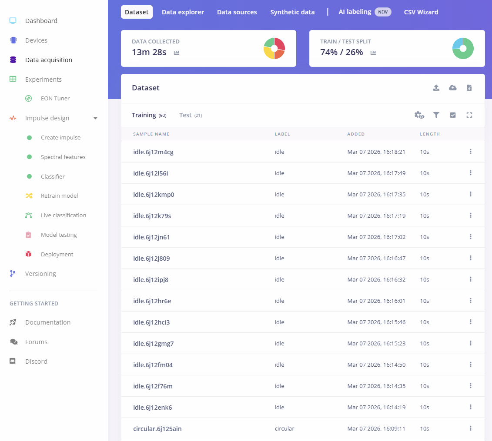
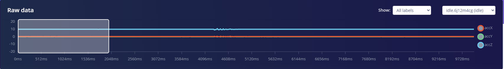
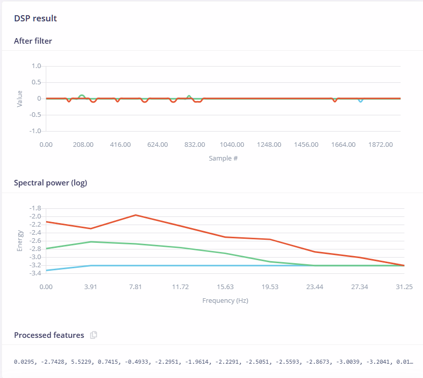
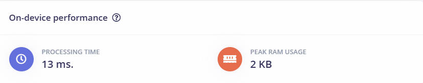
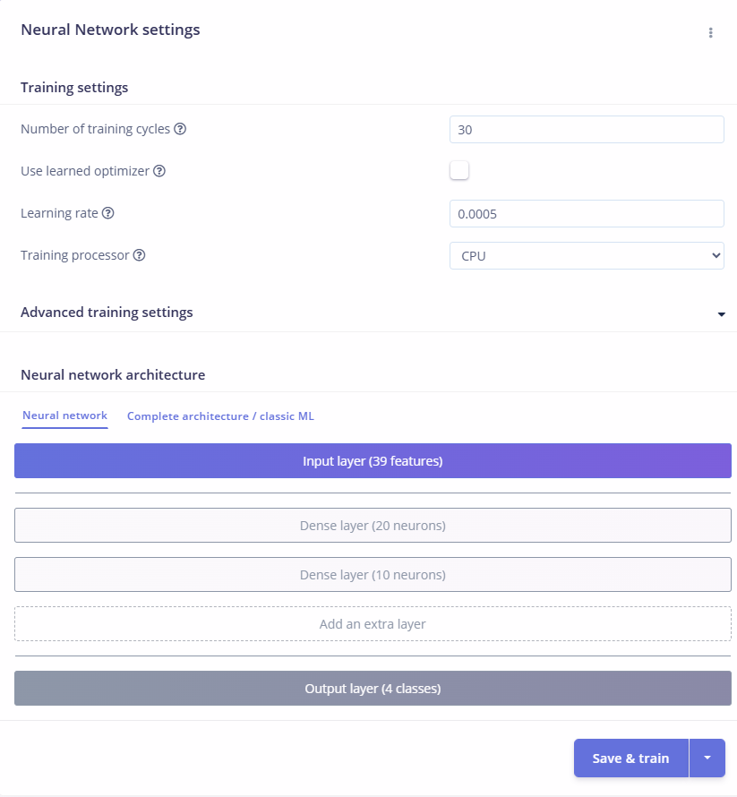
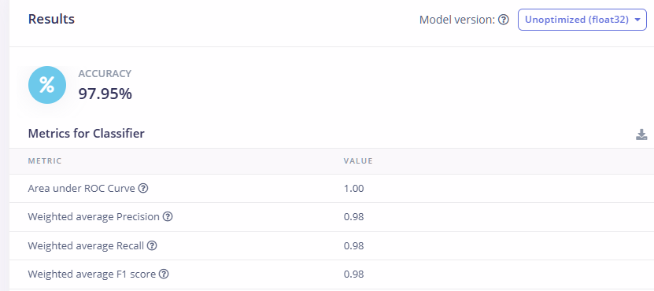
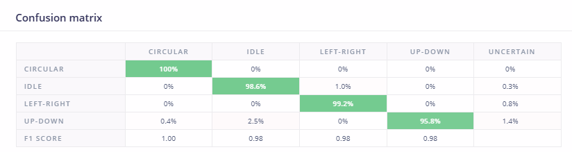
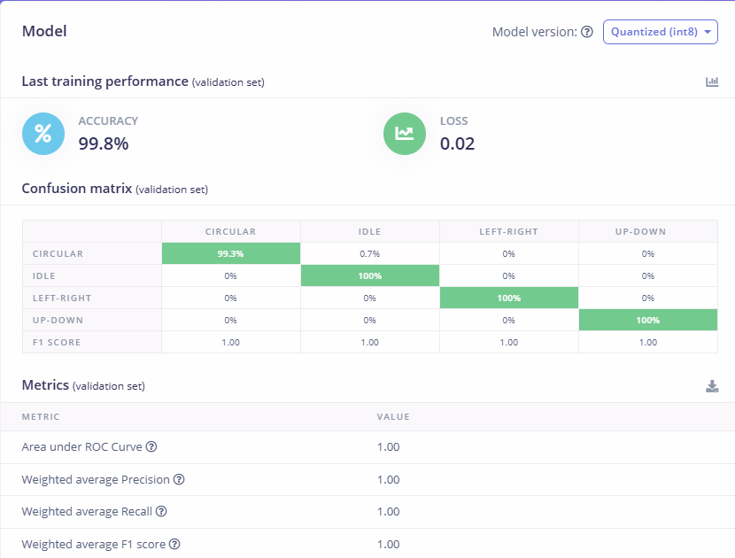
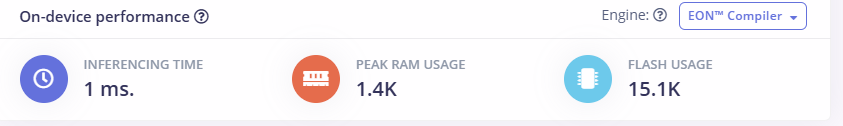

# Smartphone Motion Recognition: Edge Impulse TinyML

An end-to-end Machine Learning project that classifies physical gestures in real-time using raw 3-axis accelerometer data. The model was designed, trained, and profiled entirely within the Edge Impulse MLOps platform.

## Project Overview & Resourcefulness
The goal of this project was to build a spatial awareness AI capable of classifying 4 distinct states:
* `idle` (resting)
* `circular` (rotating motion)
* `left-right` (horizontal shaking)
* `up-down` (vertical shaking)

**The Hardware Constraint:** I did not have immediate access to an officially supported Edge Impulse development board (like an Arduino Nano 33 BLE). 
**The Solution:** I bypassed the hardware limitation by linking my smartphone directly to the Edge Impulse studio via WebUSB/QR Code. I utilized the phone's built-in accelerometer to stream live 3-axis (X, Y, Z) data directly into my project's data acquisition pipeline.

  

---

## Step 1: Data Collection & Preprocessing
Using the smartphone, I captured over **13 minutes** of continuous time-series data, properly splitting it into a 74% / 26% Train/Test split to prevent model overfitting.

  

Instead of feeding raw time-series data directly into a neural network (which is inefficient), I designed an **Impulse Pipeline** to extract features first.
* **Windowing:** 2,000 ms window size with a 200 ms stride.
* **Frequency:** 62.5 Hz sampling rate.

  

---

## 🧮 Step 2: DSP (Digital Signal Processing)
To help the neural network understand the movements, I used a **Spectral Analysis** block. This block applies a filter and performs a Fast Fourier Transform (FFT) to extract frequency and power characteristics from the accelerometer data.

  

**DSP Profiling:** The extracted features drastically simplify the workload for the AI. Calculating these features on-device takes only **13 ms** and uses a peak RAM of just **2 KB**.

  

---

## Step 3: Neural Network Training
With the 39 features extracted by the DSP block, I designed a lightweight fully-connected Dense Neural Network. 
* **Input Layer:** 39 Features
* **Hidden Layers:** 20 Neurons 10 Neurons
* **Output Layer:** 4 Classes
* **Hyperparameters:** 30 Epochs, 0.0005 Learning Rate

  

---

## 🚀 Step 4: Model Evaluation & Quantization

I evaluated the model in two different states to understand the trade-offs between precision and memory footprint.

### 1. Unoptimized Model (Float32)
The standard 32-bit floating-point model performed exceptionally well on the test data, achieving an accuracy of **97.95%**.

  

  

### 2. Quantized Model (INT8) + EON Compiler
For true TinyML deployment, I quantized the weights to 8-bit integers (`INT8`). In this specific instance, quantization actually acted as a form of regularization, slightly boosting the validation accuracy to **99.8%**!

  

**The Edge AI Profiling:** Using Edge Impulse's EON™ Compiler, the final optimized model has an incredibly tiny footprint, making it perfectly suited for extreme edge microcontrollers (like ARM Cortex-M0/M4 chips):
* **Inferencing Time:** 1 ms
* **Peak RAM Usage:** 1.4 KB
* **Flash Usage:** 15.1 KB

  

---
